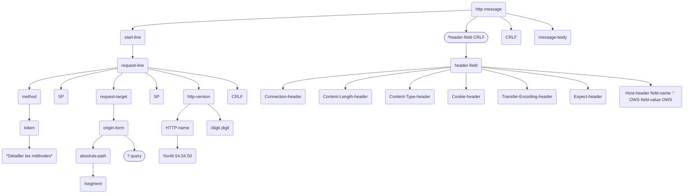

Objectif : créer un arbre de dérivation complet à partir de ```HTTP-message = start-line * ( header-field CRLF ) CRLF [ message-body ]```
 


```mermaid
graph TD
    0(http-message)-->1(start-line)
    0-->2([*header-field CRLF])
    2-->3(header-field);
    0-->4(CRLF);
    0-->5(message-body);
    1-->10(request-line);

    10-->11(method);
    10-->12(SP);
    10-->13(request-target);
    10-->14(SP);
    10-->15(http-version);
    10-->16(CRLF);
    11-->20(token);

    20-->21(*Détailler les méthodes*)
    13-->22(origin-form)
    22-->23(absolute-path)
    23-->25(/segment)
    22-->24(["?" query])
    15-->26(HTTP-name)
    15-->27(/digit.digit)
    26-->28(%x48.54.54.50)

    3-->30(Connection-header)
    3-->31(Content-Length-header)
    3-->32(Content-Type-header)
    3-->33(Cookie-header)
    3-->34(Transfer-Encoding-header)
    3-->35(Expect-header)
    3-->36(Host-header field-name ':' OWS field-value OWS ) 
```